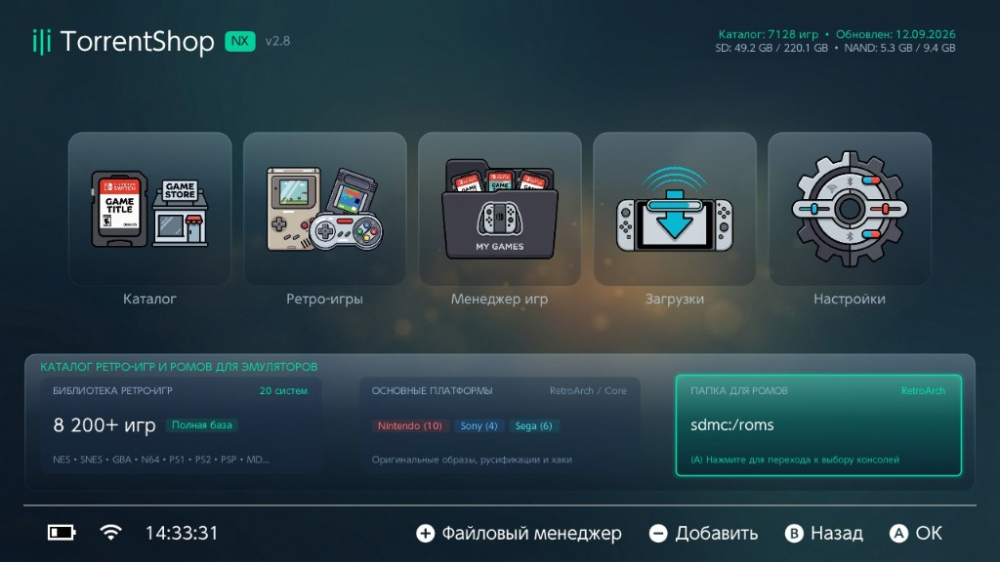
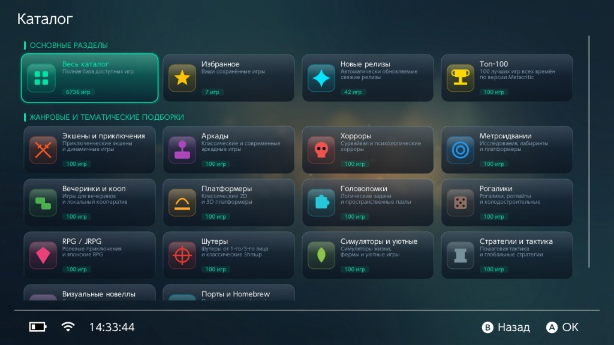
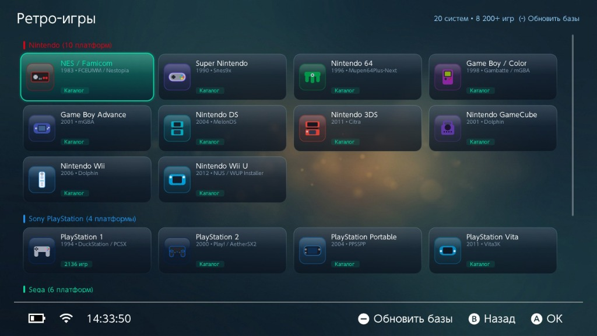

<div align="center">


# TorrentShopNX

**BitTorrent client, game & retro console catalog with direct stream installation for Nintendo Switch**

[](https://github.com/Langegen/TorrentShopNX/releases/latest)
[](README.md)

[](https://github.com/Langegen/TorrentShopNX/releases/latest)
[](https://github.com/Langegen/TorrentShopNX/releases)
[](LICENSE)
[](https://github.com/Langegen/TorrentShopNX)
[](https://github.com/natinusala/borealis)

[🇷🇺 Русский](README.md) | **🇬🇧 English**

---
</div>

**TorrentShopNX** is an all-in-one homebrew application for Nintendo Switch combining an extensive game catalog, a built-in high-performance BitTorrent client, direct on-the-fly stream installation, an 8,200+ retro games catalog for 20 platforms, and a full-featured file manager with built-in archive extraction. It enables you to discover, download, and install games, updates, DLCs, and retro ROMs directly onto your console without requiring a PC or external servers.

> [!IMPORTANT]
> **Notice:** This project is developed strictly for educational and research purposes. Only use this application with content that you have the legal right to access and use.

---

## 📸 Screenshots

<div align="center">
  
  <p><em>Main Menu & Dashboard (v2.8): Quick access to the game catalog, retro platforms, game manager, downloads, and storage stats</em></p>
  <br/>

  
  <p><em>Game Catalog: Main sections (new releases, Metacritic Top 100, favorites) and 14 genre collections</em></p>
  <br/>

  
  <p><em>Retro Games Catalog: Over 8,200 games across 20 systems (Nintendo, Sony PlayStation, Sega) with direct saving to RetroArch folders</em></p>
</div>

---

## ✨ Key Features

- ⚡ **Built-in BitTorrent Engine (Custom Engine)**:
  - Fully standalone — runs natively on Nintendo Switch without requiring an external server or PC.
  - Comprehensive protocol support: DHT (Kademlia), µTP, PEX, UDP/HTTP(S) trackers, fast magnet metadata exchange (BEP 9 / ut_metadata).
  - Intelligent piece picker with a sliding-window pre-buffer optimized for direct streaming installations.
  - Inbound connection port forwarding support (default TCP `6882`) to maximize reachable peers in swarms.

- 🎮 **Direct On-The-Fly Stream Installation (Stream Installer)**:
  - Stream install NSP, NCZ, XCI, updates, and DLCs directly into console storage (SD card or NAND memory).
  - **FAT32-friendly**: Eliminates the need to download huge 20–40+ GB intermediate archive files before installation, saving storage space and SD card write cycles.

- 🕹️ **Retro Games & ROMs Catalog for Emulators (v2.8)**:
  - Massive library: **over 8,200+ games across 20 gaming platforms**:
    - **Nintendo (10 systems)**: NES / Famicom, Super Nintendo (SNES), Nintendo 64, Game Boy / Color, Game Boy Advance, Nintendo DS, Nintendo 3DS, GameCube, Wii, Wii U.
    - **Sony (4 systems)**: PlayStation 1, PlayStation 2, PlayStation Portable (PSP), PlayStation Vita.
    - **Sega (6 systems)**: Mega Drive / Genesis, Master System, Game Gear, Dreamcast, Saturn, SG-1000.
  - Includes original clean dumps, localized releases, and popular fan hacks.
  - Automatic download to emulator folders (default `sdmc:/roms/<console>/`) ready to run in RetroArch or standalone emulators.
  - Online retro database updates directly from GitHub via the `-` button.
  - Configurable romset download modes (full download or individual file selection).

- 🗂️ **Built-in File Manager & Utilities (v2.8)**:
  - Fast access from anywhere in the app with the `+` button.
  - Full SD card navigation and file/folder management.
  - **Archive Extractor (7zsdk)**: Built-in unpacking for `.7z`, `.zip`, `.rar` archives with live extraction progress dialog.
  - **Package Installer**: Install NSP, NSZ, XCI, XCZ files directly from local storage.
  - **Built-in Text Viewer**: View NFO files, READMEs, and text documents directly on the console.
  - Press `A` on completed non-game downloads to immediately reveal them in the file manager.

- 📚 **Rich Game Catalog & Curated Collections**:
  - Built-in, regularly updated catalogs in both English and Russian.
  - **Main Sections**: "All Catalog" (thousands of games), "New Releases", "Metacritic Top 100", and "Favorites".
  - **14 Curated Genre & Thematic Collections**: Action & Adventure, Arcades, Horrors, Metroidvanias, Party & Co-op, Platformers, Puzzles, Roguelikes, RPG / JRPG, Shooters, Simulators & Cozy, Strategy & Tactics, Visual Novels, Ports & Homebrew.
  - Instant search using the native Switch on-screen keyboard, with flexible sorting and filtering (by genre, date, file size).

- 🖼️ **Detailed Game Cards**:
  - High-resolution box art covers with local SD thumbnail caching for smooth scrolling.
  - Built-in screenshot gallery with a full-screen image viewer.
  - Detailed descriptions, download sizes, voice and subtitle language information.
  - Favorites system for bookmarking titles you want to install later.

- 📱 **Remote Torrent Adding (Web UI & QR Code)**:
  - Built-in local HTTP server on the Switch (port `8080`) displaying an instant QR code on the screen.
  - Easily send magnet links or upload `.torrent` files directly from your smartphone or PC.

- 🎯 **Selective File Downloading**:
  - Inspect torrent contents and choose specific files (base game, specific updates, individual DLCs) prior to download.

- 📥 **Advanced Downloads Manager**:
  - Real-time download progress, transfer speeds, peer/seed counts, and install phase status (preparation / streaming / installation).
  - Ability to pause, cancel, and manage installation queues.

- 💾 **Game Manager & Storage Monitor**:
  - View installed titles, versions, and DLCs.
  - Real-time monitoring of free and used storage on both SD card and NAND memory in the dashboard header.

- 🔋 **Power Management & Comfort**:
  - Prevents console sleep mode during active downloads.
  - Configurable screen backlight timeout to save battery and protect OLED screens during long downloads.
  - Applet Mode detection and warning with advice to run via Title Override for full memory allocation.

- 🔄 **Built-in Auto Updater**:
  - Automatically checks for and installs application updates directly from GitHub Releases with one click.

- 🌐 **Alternative Backend (TorrServer)**:
  - Option to connect to an external TorrServer instance on your local network if you prefer caching on a home server or NAS.

---

## 🎮 Controls & Shortcuts

| Button | Action |
| :---: | :--- |
| **`+`** | Open built-in **File Manager** |
| **`-`** | **Remote Add** (Web UI / QR) / **Update Databases** (in Retro Games) |
| **`A`** | Select / Confirm / Open download folder in File Manager |
| **`B`** | Back / Close dialog |
| **`X`** | Quick search in catalog |
| **`Y`** | Filter & Sort / Add to Favorites |

---

## 🚀 Quick Start & Installation

### 1. Download
Download the latest `TorrentShopNX.nro` from the [Releases](https://github.com/Langegen/TorrentShopNX/releases/latest) page or click the download button at the top of this page.

### 2. Copy to SD Card
Place `TorrentShopNX.nro` onto your SD card at the following path:
```text
sdmc:/switch/TorrentShopNX/TorrentShopNX.nro
```

### 3. Launching the App

> [!WARNING]
> **Important: Run with Full Memory Access (Title Override)!**
> 
> Do **not** launch the app via the **Album (Applet Mode)**. In Applet Mode, the console only allocates ~400 MB of RAM to homebrew, which will cause out-of-memory errors during game extraction and installation.
> 
> **How to launch properly:**
> 1. Press and hold the **`R`** button on your controller.
> 2. Launch **any installed game** from the Switch main menu while holding `R`.
> 3. The Homebrew Menu will open with access to the console's full memory pool (High Memory Mode).
> 4. Launch **TorrentShopNX**.

---

## 📱 Adding Torrents from Smartphone or PC

If a game is not available in the built-in catalog, you can instantly push any torrent or magnet link from your phone or computer:

```text
+-----------------------------------------------------------+
| 1. Press "-" or open the "Remote Add" section in the app  |
| 2. Scan the displayed QR code with your phone camera      |
|    (or navigate to the URL shown, e.g.                    |
|     http://192.168.1.50:8080)                             |
| 3. Paste a magnet link or upload a .torrent file          |
| 4. Tap "Send" — the Switch will open the file picker      |
+-----------------------------------------------------------+
```

---

## ⚙️ Configuration (`config.ini`)

The configuration file is created automatically on first launch:
```text
sdmc:/switch/TorrentShopNX/config.ini
```

### Example Configuration:
```ini
[general]
data_mode=local_client
torrserver_url=http://192.168.1.100:8090
catalog_source_url=https://raw.githubusercontent.com/Langegen/switch-game-collection/refs/heads/main/EN_catalog.json
install_location=sd
keep_awake_during_downloads=true
backlight_timeout=60
cache_cover_thumbnails=true
listen_port=6882
auto_app_update=true
language=en

# Retro Games settings
retro_roms_mode=retroarch
retro_custom_path=sdmc:/roms/
retro_auto_extract=false
retro_romset_mode=full
```

### Settings Reference:

| Parameter | Possible Values | Description |
| :--- | :--- | :--- |
| `data_mode` | `local_client` / `torrserver` | Backend mode: built-in custom engine (`local_client`) or external TorrServer (`torrserver`). |
| `catalog_source_url` | `http(s)://...` | URL to the remote JSON game catalog. |
| `install_location` | `auto` / `sd` / `nand` | Target storage for game installation: SD Card (`sd`), internal NAND (`nand`), or `auto`. |
| `torrserver_url` | `http(s)://...` | Address of external TorrServer (when `data_mode=torrserver`). |
| `keep_awake_during_downloads`| `true` / `false` | Prevents the console from going to sleep while downloading. |
| `backlight_timeout` | `0`, `15`, `30`, `60`, `120` | Seconds before screen backlight dims/turns off (`0` = never turn off). |
| `cache_cover_thumbnails` | `true` / `false` | Enables local thumbnail caching on SD card for smoother scrolling. |
| `listen_port` | `1024–65535` (default `6882`) | Inbound TCP listen port for peer connections. Forward this port on your router for maximum speed. |
| `auto_app_update` | `true` / `false` | Automatically check for app updates on startup. |
| `language` | `auto` / `en` / `ru` / `zh-Hans` / `fr` | Application interface language. |
| `retro_roms_mode` | `retroarch` / `downloads` / `custom` | Target folder for ROM downloads: RetroArch (`sdmc:/roms/<console>/`), downloads folder, or custom path. |
| `retro_custom_path` | `sdmc:/...` | Custom directory path for ROMs (used when `retro_roms_mode=custom`). |
| `retro_auto_extract` | `true` / `false` | Automatically extract downloaded ROM archives upon completion. |
| `retro_romset_mode` | `full` / `select` | Romset download mode: download the full set archive (`full`) or select individual files (`select`). |

---

## 📋 Catalog Source Format

TorrentShopNX supports custom JSON game catalogs matching the following structure:

```json
[
  {
    "title": "Super Game Odyssey",
    "size": "5.42 GB",
    "magnet": "magnet:?xt=urn:btih:EXAMPLEHASH&dn=Game...",
    "topic_id": "1234567",
    "url": "https://example.com/topic/1234567",
    "year": "2023",
    "genre": "Platformer, Adventure",
    "developer": "Awesome Studio",
    "publisher": "Awesome Publisher",
    "image_format": "NSP",
    "interface_lang": "English, Russian",
    "voice_lang": "English",
    "cover": "https://example.com/covers/game.png",
    "screenshots": [
      "https://example.com/screens/1.jpg",
      "https://example.com/screens/2.jpg"
    ],
    "description": "Detailed description of the game..."
  }
]
```

---

## 🛠️ Building from Source

### Prerequisites:
- [devkitPro](https://devkitpro.org/) toolchain (`devkitA64`).
- Libraries: `libnx`, `switch-curl`, `switch-mbedtls`, `switch-zlib`, `switch-libpng`, `switch-libjpeg-turbo`.
- [Borealis](https://github.com/natinusala/borealis) UI submodule (included in `_external/borealis`).

### Build:
```bash
# Clone the repository with submodules
git clone --recursive https://github.com/Langegen/TorrentShopNX.git
cd TorrentShopNX

# Build the NRO binary
make -j$(nproc)
```

Build artifact:
```text
TorrentShopNX.nro
```

---

## 📂 Project Structure

```text
TorrentShopNX/
├── source/
│   ├── 7zsdk/         # Archive extraction engine (7z, ZIP, RAR)
│   ├── buffer/        # Ring buffer and piece pool management
│   ├── catalog/       # Catalog parsing, retro database, search, filtering, and collections
│   ├── config/        # Configuration reader and writer (config.ini)
│   ├── datasource/    # Data source abstractions (Custom Engine & TorrServer)
│   ├── download/      # Download queue manager and scheduling
│   ├── engine/        # Custom BitTorrent engine (DHT, uTP, Bencode, Wire)
│   ├── installer/     # Stream content installer (NSP, NCZ, XCI, NCM)
│   ├── net/           # Networking utilities, HTTP client (curl), and Web UI server
│   ├── rss/           # RSS feed parsing
│   ├── torrent/       # Torrent files and magnet links processing
│   ├── ui/            # Borealis UI views, cards, and dialogs
│   │   └── dashboard/ # Main dashboard widgets and statistics
│   └── utils/         # System utilities, logging, file helpers
├── resources/         # Fonts, icons, localization files (i18n), sounds and RomFS assets
└── docs/              # Technical documentation, architecture plans, and screenshots
    └── screenshots/   # Application interface screenshots
```

---

## 📄 License

This project is licensed under the **GNU General Public License v3.0 (GPLv3)**. See [LICENSE](LICENSE) for the full license text.

---

<div align="center">
  <sub>Made with ❤️ for the Nintendo Switch Homebrew Community</sub>
</div>
