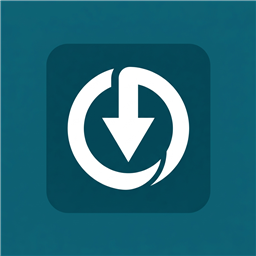

<div align="center">



# TorrentShopNX

**BitTorrent-клиент и каталог игр с прямой потоковой установкой для Nintendo Switch**

[](https://github.com/Langegen/TorrentShopNX/releases/latest)
[](README.en.md)

[](https://github.com/Langegen/TorrentShopNX/releases/latest)
[](https://github.com/Langegen/TorrentShopNX/releases)
[](LICENSE)
[](https://github.com/Langegen/TorrentShopNX)
[](https://github.com/natinusala/borealis)

**🇷🇺 Русский** | [🇬🇧 English](README.en.md)

---
</div>

**TorrentShopNX** — это многофункциональное homebrew-приложение для Nintendo Switch, объединяющее удобный каталог игр, полноценный встроенный BitTorrent-клиент и модуль прямой потоковой установки. С ним можно находить, выбирать и устанавливать игры, обновления и DLC прямо на консоль без использования ПК и сторонних серверов.

> [!IMPORTANT]
> **Внимание!** Проект создан исключительно в ознакомительных и исследовательских целях. Используйте приложение только с тем контентом, на который у вас есть законные права.

---

## ✨ Ключевые возможности

- ⚡ **Встроенный BitTorrent-движок (Custom Engine)**:
  - Полностью автономен — работает прямо на Switch, не требуя внешних серверов и запущенного ПК.
  - Поддержка протоколов: DHT (Kademlia), µTP, PEX, UDP/HTTP(S)-трекеры, быстрое получение метаданных через magnet (BEP 9 / ut_metadata).
  - Умный планировщик загрузки кусков (Piece Picker) со скользящим окном под потоковую установку.
  - Поддержка проброса входящего порта (по умолчанию TCP `6882`) для максимизации доступных пиров.

- 🎮 **Прямая потоковая установка на лету (Stream Installer)**:
  - Установка NSP, NCZ, XCI, обновлений и DLC напрямую в память консоли (SD-карту или системную память NAND).
  - **FAT32-friendly**: не требует предварительного скачивания огромных файлов архивов (20–40+ ГБ) на карту памяти перед установкой, экономя ресурс SD и свободное место.

- 📚 **Богатый каталог игр и подборки**:
  - Встроенные регулярно обновляемые каталоги на русском и английском языках.
  - Тематические подборки, свежие релизы, категории и раздел отслеживания обновлений.
  - Мгновенный поиск с использованием встроенной экранной клавиатуры Switch, удобная фильтрация и сортировка (по размеру, дате, жанрам).

- 🖼️ **Информативные карточки игр**:
  - Обложки высокого качества с локальным кэшированием миниатюр на SD для плавного скролла.
  - Встроенная галерея скриншотов с полноэкранным просмотром.
  - Подробные описания, вес раздачи, информация о языках интерфейса и озвучки.
  - Система избранного для быстрого доступа к желаемым релизам.

- 📱 **Добавление торрентов по сети (Web UI & QR-код)**:
  - Локальный веб-сервер на Switch (порт `8080`) с отображением QR-кода на экране.
  - Возможность в один клик со смартфона или ПК отправить magnet-ссылку или загрузить `.torrent` файл.

- 🎯 **Выборочная загрузка файлов**:
  - Предварительный просмотр содержимого раздачи: возможность выбрать только базовую игру, нужный патч или определенные DLC.

- 📥 **Продвинутый менеджер загрузок**:
  - Отображение прогресса в реальном времени, скорости скачивания, количества сидов/пиров, текущего этапа (подготовка / стриминг / установка).
  - Возможность приостановки, отмены и управления очередью.

- 🔋 **Энергосбережение и комфорт**:
  - Предотвращение засыпания консоли во время активной загрузки.
  - Настраиваемый тайм-аут подсветки экрана (Backlight Timeout) для экономии аккумулятора и защиты OLED-экрана.
  - Предупреждение о запуске в режиме апплета (Applet Mode) с рекомендацией запуска через Title Override.

- 🔄 **Встроенное автообновление**:
  - Автоматическая проверка и обновление приложения до последней версии с GitHub Releases прямо из меню.

- 🌐 **Альтернативный бэкенд (TorrServer)**:
  - Возможность переключения на удаленный TorrServer в локальной сети, если вы предпочитаете кэширование на домашнем сервере или NAS.

---

## 🚀 Быстрый старт и установка

### 1. Загрузка
Скачайте последний файл `TorrentShopNX.nro` со страницы [Релизов](https://github.com/Langegen/TorrentShopNX/releases/latest) или воспользуйтесь кнопкой вверху страницы.

### 2. Установка на SD-карту
Скопируйте `TorrentShopNX.nro` на карту памяти по пути:
```text
sdmc:/switch/TorrentShopNX/TorrentShopNX.nro
```

### 3. Запуск приложения

> [!WARNING]
> **Важно: запускайте с полным доступом к памяти (Title Override)!**
> 
> Не запускайте приложение через **Альбом (Applet Mode)** — в этом режиме консоль выделяет всего ~400 МБ оперативной памяти, что приведет к нехватке памяти при распаковке и установке игр.
> 
> **Как запустить правильно:**
> 1. Зажмите и удерживайте клавишу **`R`** на контроллере.
> 2. Запустите **любую установленную игру** из главного меню Switch.
> 3. Откроется Homebrew Menu с полным доступом ко всей оперативной памяти (High Memory Mode).
> 4. Запустите **TorrentShopNX**.

---

## 📱 Добавление раздачи со смартфона или ПК

Если нужной игры нет во встроенном каталоге, вы можете моментально отправить любую раздачу со своего телефона или компьютера:

```
+-----------------------------------------------------------+
| 1. Откройте в приложении раздел «По сети»                 |
| 2. Отсканируйте камерой смартфона появившийся QR-код      |
|    (или перейдите по указанному адресу, напр.             |
|     http://192.168.1.50:8080)                             |
| 3. Вставьте magnet-ссылку или выберите .torrent файл      |
| 4. Нажмите «Отправить» — Switch откроет окно выбора файлов|
+-----------------------------------------------------------+
```

---

## ⚙️ Конфигурация (`config.ini`)

Файл настроек создается автоматически при первом запуске:
```text
sdmc:/switch/TorrentShopNX/config.ini
```

### Пример файла настроек:
```ini
[general]
data_mode=local_client
torrserver_url=http://192.168.1.100:8090
catalog_source_url=https://raw.githubusercontent.com/Langegen/switch-game-collection/refs/heads/main/RU_catalog.json
install_location=sd
keep_awake_during_downloads=true
backlight_timeout=60
cache_cover_thumbnails=true
listen_port=6882
auto_app_update=true
language=ru
```

### Описание параметров:

| Параметр | Возможные значения | Описание |
| :--- | :--- | :--- |
| `data_mode` | `local_client` / `torrserver` | Режим работы: собственный встроенный движок (`local_client`) или внешний TorrServer (`torrserver`). |
| `catalog_source_url` | `http(s)://...` | URL адрес JSON-каталога игр. |
| `install_location` | `sd` / `nand` | Место установки игр: карта памяти (`sd`) или встроенная память консоли (`nand`). |
| `torrserver_url` | `http(s)://...` | Адрес удаленного сервера TorrServer (для режима `torrserver`). |
| `keep_awake_during_downloads`| `true` / `false` | Запрещает переход консоли в спящий режим во время активного скачивания. |
| `backlight_timeout` | `0`, `15`, `30`, `60`, `120` | Время в секундах до отключения подсветки экрана (`0` — не выключать). |
| `cache_cover_thumbnails` | `true` / `false` | Кэширование сжатых миниатюр обложек на SD-карту для быстрой прокрутки. |
| `listen_port` | `1024–65535` (стандартно `6882`) | Входящий TCP-порт для пиров. Пробросьте этот порт на роутере для максимальной скорости. |
| `auto_app_update` | `true` / `false` | Автоматическая проверка наличия обновлений приложения при запуске. |
| `language` | `ru` / `en` | Язык интерфейса приложения. |

---

## 📋 Формат источников каталога

TorrentShopNX поддерживает загрузку пользовательских каталогов в формате JSON:

```json
[
  {
    "title": "Super Game Odyssey",
    "size": "5.42 GB",
    "magnet": "magnet:?xt=urn:btih:EXAMPLEHASH&dn=Game...",
    "topic_id": "1234567",
    "url": "https://example.com/topic/1234567",
    "year": "2023",
    "genre": "Platformer, Adventure",
    "developer": "Awesome Studio",
    "publisher": "Awesome Publisher",
    "image_format": "NSP",
    "interface_lang": "Русский, Английский",
    "voice_lang": "Английская",
    "cover": "https://example.com/covers/game.png",
    "screenshots": [
      "https://example.com/screens/1.jpg",
      "https://example.com/screens/2.jpg"
    ],
    "description": "Подробное описание игры..."
  }
]
```

---

## 🛠️ Сборка из исходного кода

### Требования:
- Установленный тулчейн [devkitPro](https://devkitpro.org/) (devkitA64).
- Библиотеки `libnx`, `switch-curl`, `switch-mbedtls`, `switch-zlib`, `switch-libpng`, `switch-libjpeg-turbo`.
- Исходный код [Borealis](https://github.com/natinusala/borealis) (включен как submodule в `_external/borealis`).

### Сборка:
```bash
# Клонирование репозитория вместе с подмодулями
git clone --recursive https://github.com/Langegen/TorrentShopNX.git
cd TorrentShopNX

# Компиляция проекта
make -j$(nproc)
```

Готовый исполняемый файл:
```text
TorrentShopNX.nro
```

---

## 📂 Структура проекта

```text
TorrentShopNX/
├── source/
│   ├── buffer/        # Кольцевой буфер и управление пулом кусков в памяти
│   ├── catalog/       # Менеджер каталога, поиск, фильтры, подборки
│   ├── config/        # Чтение и запись конфигурации config.ini
│   ├── datasource/    # Модули источников данных (Custom Engine и TorrServer)
│   ├── download/      # Менеджер очереди загрузок и планировщик
│   ├── engine/        # Собственный BitTorrent-клиент (DHT, uTP, Bencode, Wire)
│   ├── installer/     # Потоковый установщик контента (NSP, NCZ, XCI, NCM)
│   ├── net/           # Сетевые утилиты, HTTP-клиент (curl) и локальный Web-сервер
│   └── ui/            # Пользовательский интерфейс Borealis (экраны, карточки, диалоги)
├── resources/         # Шрифты, иконки, локализации (i18n), изображения
└── docs/              # Техническая документация и планы разработки
```

---

## 📄 Лицензия

Проект распространяется под лицензией **GNU General Public License v3.0 (GPLv3)**. Подробности смотрите в файле [LICENSE](LICENSE).

---

<div align="center">
  <sub>Создано с ❤️ для сообщества Nintendo Switch Homebrew</sub>
</div>
